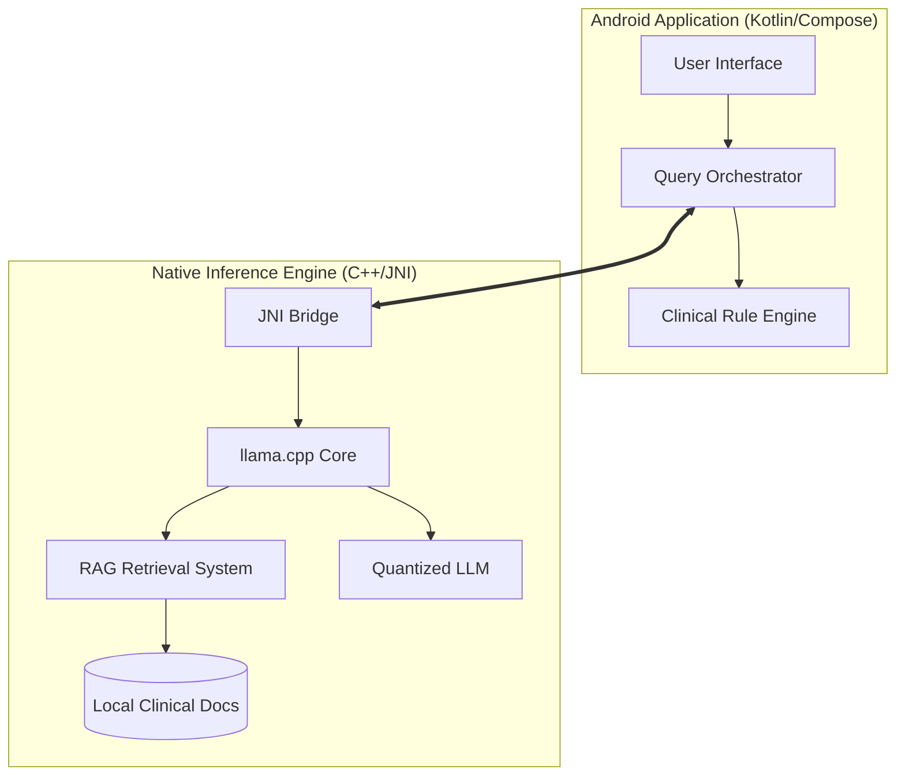

# ObsIA: The First Fully Offline AI for Maternal & Obstetric Care


**ObsIA** is a groundbreaking clinical decision support system designed to provide high-level AI capabilities in the most challenging environments. Built for obstetricians and maternal health teams, ObsIA operates **100% offline**, ensuring that critical medical knowledge is available even in remote areas without cellular or satellite coverage.

---

## 🌟 The Vision

In rural and emergency clinical settings, every second counts. Lack of connectivity often prevents access to modern AI assistants. **ObsIA** bridges this gap by bringing the power of Large Language Models (LLMs) and Retrieval-Augmented Generation (RAG) directly into the clinician's pocket.

### Core Objectives:
1.  **Empower Rural Healthcare**: Provide expert-level clinical support where specialists are unavailable.
2.  **Absolute Privacy**: No data leaves the device, complying with the strictest medical data regulations.
3.  **Instant Availability**: Zero latency from network round-trips; the AI is as fast as the local processor.

---

## 🏗️ System Architecture

ObsIA uses a **Hybrid Dual-Core Architecture** to balance modern Android UI flexibility with raw C++ performance.



### 1. The Kotlin/Compose Frontend (`app/`)
Handles the user experience, chat state management, and the **Clinical Rule Engine**. This engine acts as a deterministic safety layer, ensuring that critical emergency protocols (like Eclampsia or Postpartum Hemorrhage) are handled with 100% predictable logic before the AI even starts "thinking."

### 2. The Native C++ Backend (`Modelo/`)
This is the heart of the system. We use a customized fork of `llama.cpp` optimized for ARM64 (Android) architectures.
- **Model Development (`Modelo/llm/`)**: This is our research lab. We use Python and specialized tools here to prepare documents, generate Faiss/Binary embeddings, and quantize the models (from FP16 to 4-bit) to fit mobile RAM constraints.
- **Production Engine (`Modelo/modeloFinal/`)**: This folder contains the specialized C++ code that compiles into a `.so` (shared object) library. It is designed for maximum speed and efficient memory management.

---

## 🧠 Intelligent Pillars

### 📋 Deterministic Rule Engine
Before the LLM processes a query, a rule-based system scans for "red flag" clinical symptoms. If a life-threatening emergency is detected (e.g., severe hypertension in pregnancy), the system immediately triggers a validated clinical protocol response.

### 📚 RAG (Retrieval-Augmented Generation)
To eliminate "AI hallucinations," ObsIA doesn't rely solely on the model's training data. Instead:
1.  **Indexing**: Clinical guides (PDFs) are chunked and converted into vector embeddings during development.
2.  **Retrieval**: When a clinician asks a question, the system finds the most relevant text snippets from the local knowledge base.
3.  **Generation**: The LLM uses these snippets as context to generate a response that is grounded in clinical evidence.

---

## 📂 Project Structure

| Path | Purpose |
| --- | --- |
| `app/` | Source code for the Android application (Kotlin). |
| `Modelo/` | Central hub for all AI-related logic. |
| `Modelo/llm/` | Research scripts, RAG indexing tools, and model quantization tests. |
| `Modelo/modeloFinal/` | Native C++ inference engine source and JNI interface. |
| `doc/` | Comprehensive technical documentation, analysis, and design diagrams. |

---

## 🛠️ Setup & Development

### Prerequisites:
- **Android Studio Jellyfish** (or newer).
- **Android NDK** (Side-by-side) & **CMake**.
- A device with at least **8GB RAM** for optimal inference (6GB minimum).

### Build Instructions:
1.  **Clone the Repo**: Ensure submodules are initialized.
2.  **Native Build**: Navigate to `Modelo/modeloFinal` and run the provided build scripts or let Android Studio handle the CMake sync.
3.  **Model Loading**: Place your quantized `.gguf` model in the `app/src/main/assets/` directory (ensure it is listed in `.gitignore` to avoid large file errors).
4.  **Run**: Build the APK and deploy to your device.

---

## 👥 The Team

| Name | Role | Focus |
| --- | --- | --- |
| **Luis** | **AI Lead & Engineer** | Native C++ optimization, JNI Bridge, and Model Architecture. |
| **Julián** | **Lead Frontend** | UI/UX Design, Jetpack Compose, and Chat Lifecycle. |
| **Valentina** | **Business Logic/RAG** | Clinical knowledge base indexing and RAG orchestration. |
| **Rafa** | **Backend & QA** | Rule Engine development, persistence, and JNI integration testing. |

---

## Testing

ObsIA defines 5 critical smoke test points that cover the core clinical safety flows.

| # | Critical Point | Flow Covered | Test Type | Execution |
|---|---|---|---|---|
| 1 | **Emergency keyword detection** | `EmergencyDetector.analizar()` correctly classifies active emergency reports vs. educational queries | Unit | `./gradlew test --tests "*.EmergencyDetectorTest"` |
| 2 | **Clinical rule resolution** | `EmergencyClinicalRules.lookup()` returns a structured plan with `immediate_steps` and `disclaimer` for matched emergencies, and `null` for educational/unrelated queries | Unit | `./gradlew test --tests "*.EmergencyClinicalRulesTest"` |
| 3 | **Full query orchestration (stub mode)** | `QueryOrchestrator.processStreaming()` routes queries correctly — emergency rule path fires before LLM, routine queries reach the LLM stub | Integration | `./gradlew test` with `LlmEngineStub` wired in `AppModule` |
| 4 | **Chat UI render and message flow** | Messages appear in the chat list after send; streaming tokens append correctly; loading indicator shows/hides | e2e (Espresso/Compose) | `./gradlew connectedAndroidTest` (requires device) |
| 5 | **Offline model initialization** | App launches without network, `NativeEngine.init()` loads the `.gguf` model from assets and returns non-null context within timeout | Integration (on-device) | `./gradlew connectedAndroidTest` (requires device with model asset) |

### Running unit tests (points 1 & 2 — implemented)

```bash
./gradlew test
# Reports: app/build/reports/tests/testDebugUnitTest/index.html
```

Points 3–5 require a physical ARM64 device with the model asset and are validated manually during demo.

---

## 🛑 Project Limitations

### 1. Clinical Scope
- **Not a diagnostic system:** ObsIA is defined exclusively as a clinical decision support tool, not a replacement for autonomous professional diagnosis.
- **Knowledge base scope:** Responses are limited to the clinical knowledge base loaded and versioned in the system.

### 2. Technical Constraints (Hardware)
- **Model capacity:** Due to mobile deployment, the model is limited to approximately 1B parameters to ensure technical viability.
- **Device resources:** Performance is subject to severe RAM, CPU, and battery constraints of the target device.
- **Aggressive optimization:** Offline execution requires heavy quantization and optimization of both the model and the RAG system.

### 3. Deployment & Environment
- **Device diversity:** Correct behavior may vary across hardware manufacturers, requiring additional multi-device testing effort.
- **Updates:** As a strictly offline application, knowledge base updates require a manual reinstallation or data package update.

---

## 🧰 Tech Stack

| Layer | Technology |
|---|---|
| Android UI | Kotlin + Jetpack Compose |
| Native AI Engine | C/C++ (llama.cpp, ARM64) |
| Interoperability | JNI (Java Native Interface) |
| LLM format | Quantized GGUF (Q4_K_M) |
| Packaging | APK with bundled assets (model + RAG) |

---

## 📂 Documentation

| Section | Link |
|---|---|
| Main documentation | [doc/index.md](./doc/index.md) |
| Analysis folder | [doc/analysis/index.md](./doc/analysis/index.md) |
| Functional requirements | [doc/analysis/requirements-fn.md](./doc/analysis/requirements-fn.md) |
| Non-functional requirements | [doc/analysis/requirements-nfn.md](./doc/analysis/requirements-nfn.md) |
| MVP definition | [doc/analysis/mvp.md](./doc/analysis/mvp.md) |

---

## ⚖️ Legal Disclaimer

**ObsIA is a Research MVP.** It is intended for educational and clinical decision support purposes only. It is **NOT** a replacement for professional medical judgment. All generated responses should be verified against standard clinical protocols by a qualified healthcare professional.

---
*Built with ❤️ for the health of mothers and babies.*
