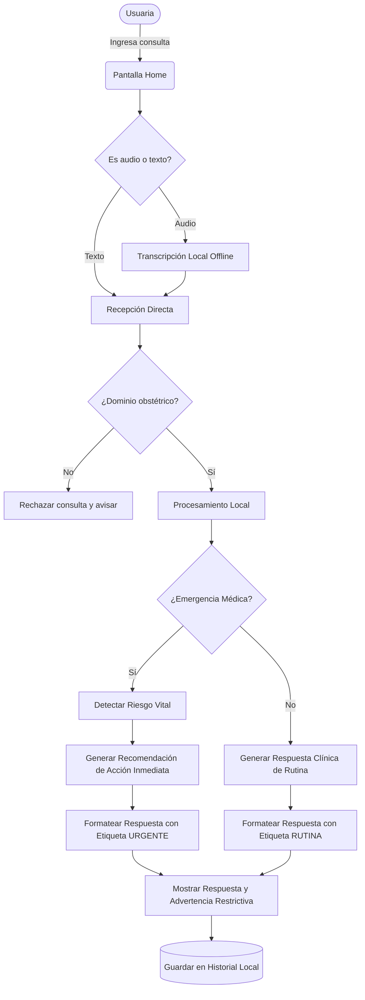
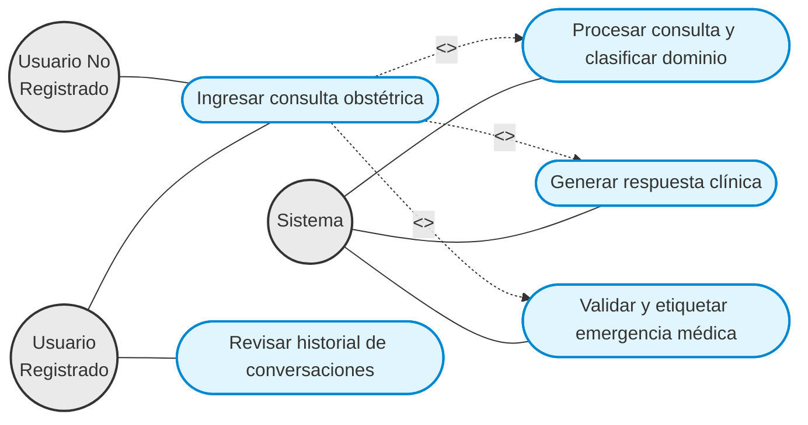
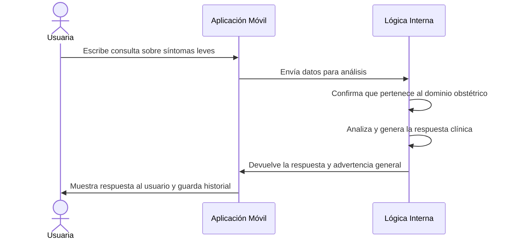
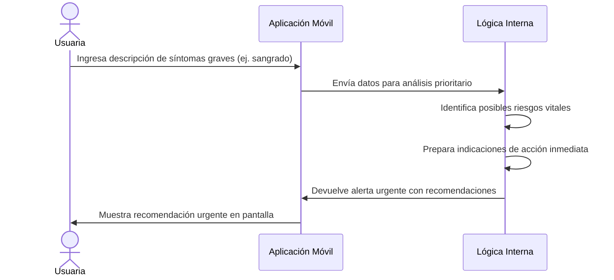

# Diagramas de Comportamiento y Diseño

En esta sección se documenta el comportamiento y diseño del producto de software utilizando diagramas UML y Ad-Hoc.

## 1. Diagrama Ad-Hoc

Este diagrama muestra el flujo general de la aplicación desde que el usuario interactúa hasta que recibe una respuesta.

## 2. Diagrama de Casos de Uso

A continuación se modelan los casos de uso separando explícitamente a los actores ("Usuario Registrado", "Usuario No Registrado" y "Sistema"). Se abstraen los detalles técnicos de generación como funcionalidades incluidas.

## 3. Diagrama de Secuencia - Caso 1 (Happy Path de Rutina)

Diagrama de secuencia simple (sin tecnicismos) ilustrando una consulta obstétrica válida que se responde normalmente.

## 4. Diagrama de Secuencia - Caso 2 (Happy Path de Emergencia)

Diagrama de secuencia enfocado en la interacción de una emergencia médica donde se despliega una acción prioritaria.

