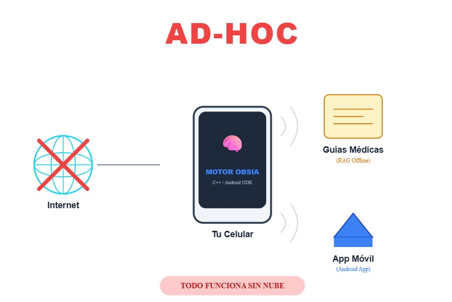
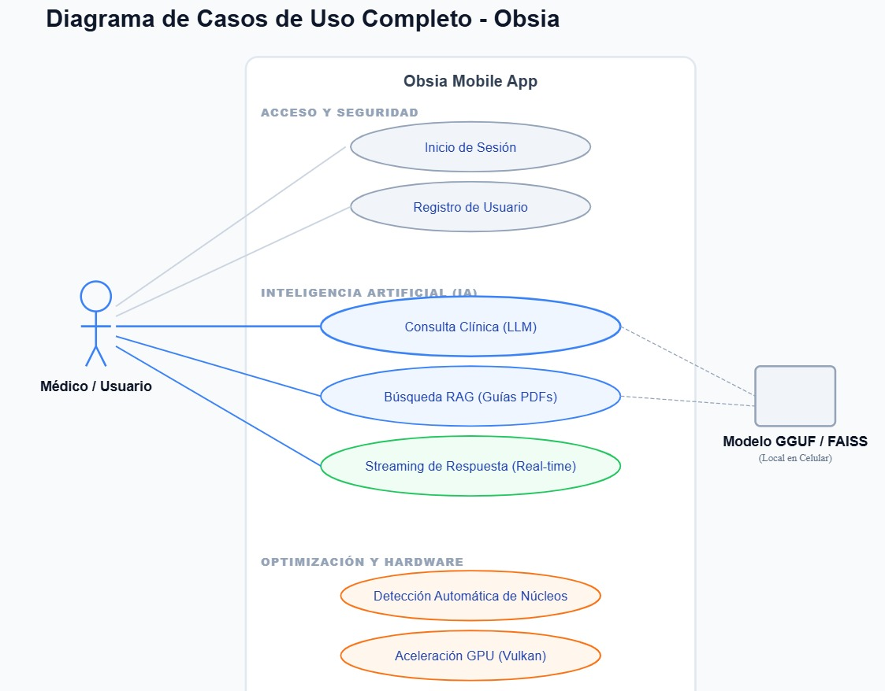
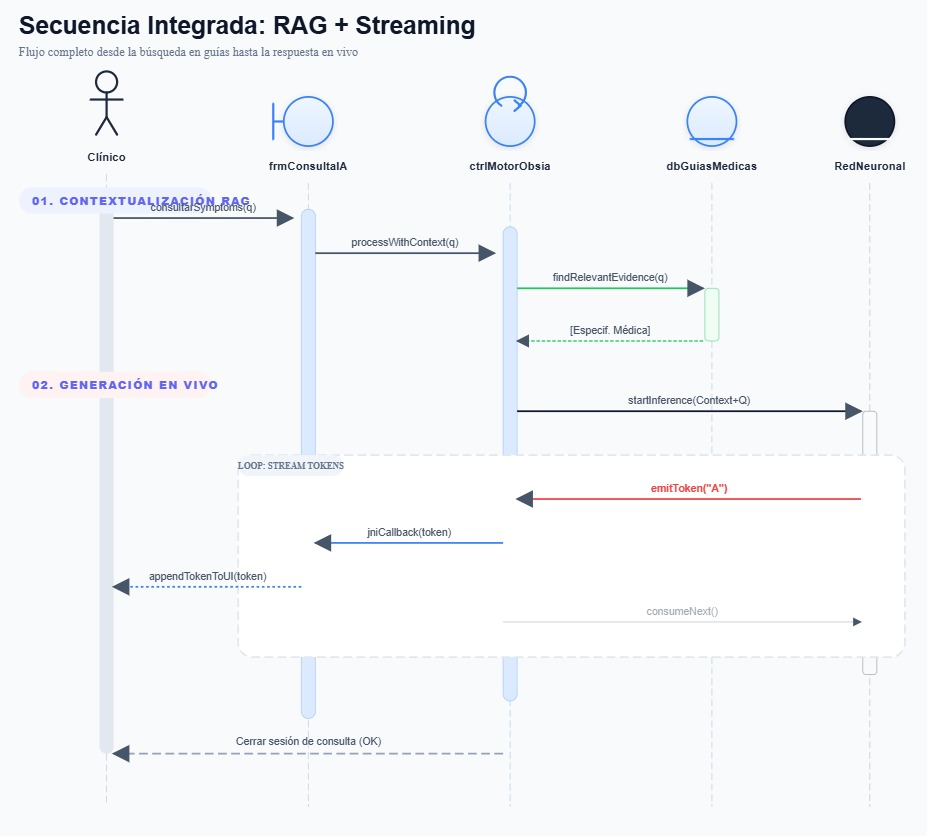
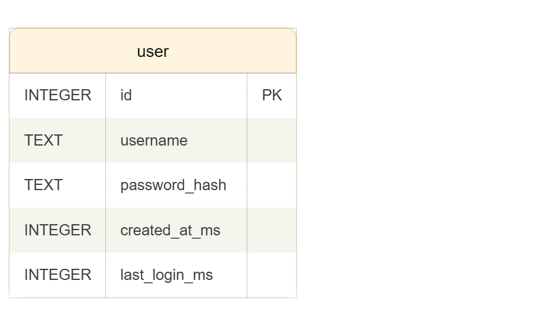
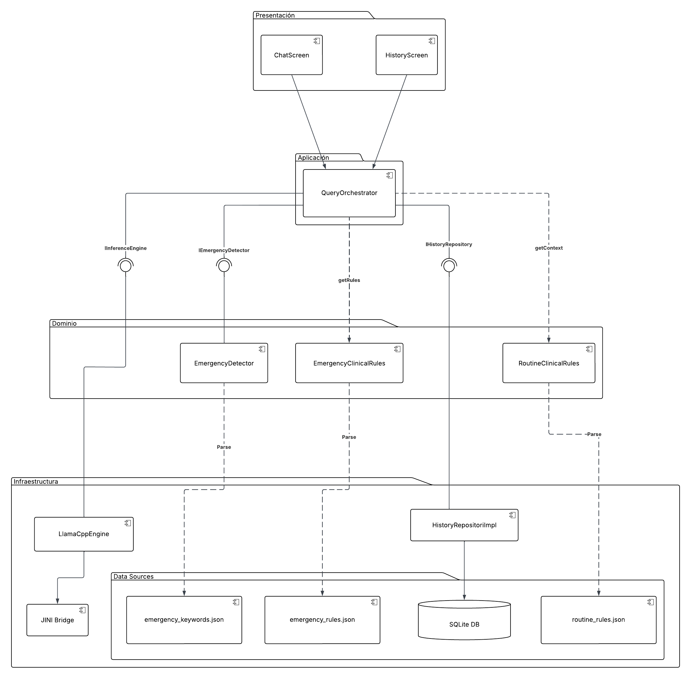

# Diagramas UML — ObsIA

Este archivo reúne los diagramas que ilustran el comportamiento y la estructura del sistema ObsIA en el contexto del MVP definido por el equipo.

---

## 1. Diagrama Ad-hoc

Descripción general del sistema desde una perspectiva contextual. Muestra cómo ObsIA opera completamente offline en el dispositivo del usuario, interactuando con las guías médicas locales (RAG offline) y la app móvil Android, sin dependencia de internet.

---

## 2. Diagrama de Casos de Uso

Representa los actores del sistema (Médico / Usuario) y los casos de uso principales del MVP, agrupados en tres categorías: Acceso y Seguridad, Inteligencia Artificial (IA) y Optimización y Hardware.

---

## 3. Diagramas de Secuencia

Flujos de los dos casos de uso principales siguiendo únicamente el happy path:

- **Caso 1 — Búsqueda RAG:** El clínico envía una consulta que es procesada por el motor Obsia, el cual busca evidencia relevante en la base de datos de guías médicas locales y retorna la información contextualizada.
- **Caso 2 — Consulta Clínica con Streaming:** A partir del contexto RAG obtenido, se inicia la inferencia sobre la red neuronal local (modelo GGUF/FAISS). Los tokens generados son emitidos en tiempo real mediante callbacks JNI hasta la UI.

---

## 4. Diagrama de Modelo Relacional

Modelo de datos del MVP. Define las entidades persistidas localmente en el dispositivo mediante SQLite.

| Entidad | Descripción |
| ------- | ----------- |
| `user` | Almacena las credenciales y metadatos del usuario registrado en la app. |

---

## 5. Diagrama de Componentes

Funciona como el "mapa de bloques" del sistema. No nos dice cómo funciona el código por dentro, sino cómo se organiza la aplicación en piezas modulares y cómo se comunican entre sí mediante interfaces.

---
