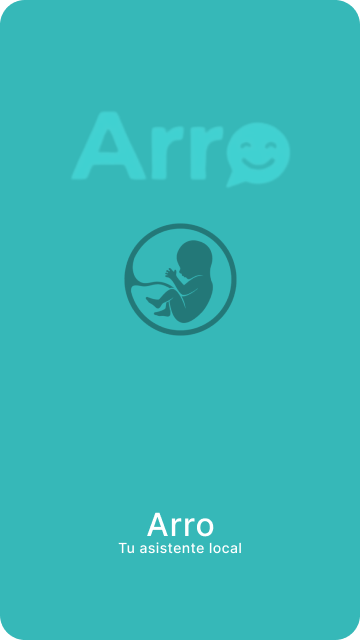
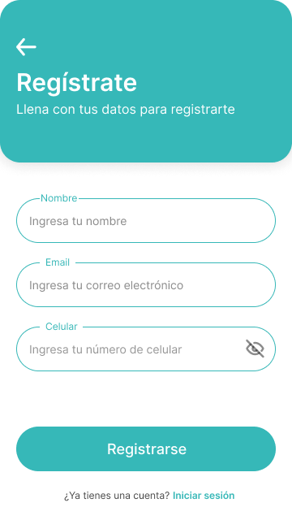
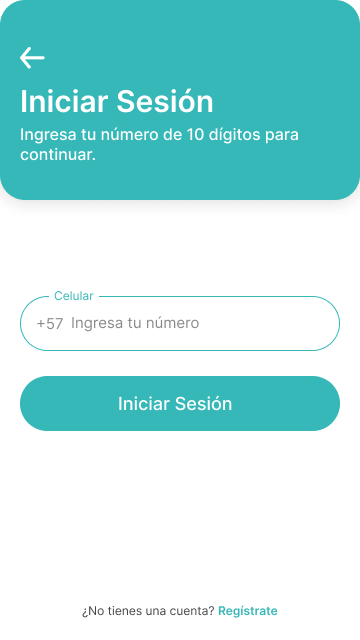
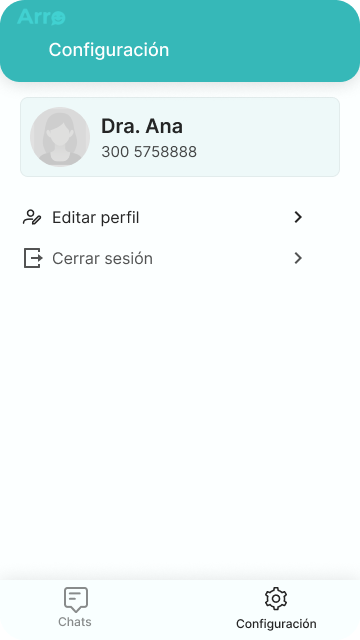

# UI - High Fidelity Designs
## Figma - Final UI Design:
https://www.figma.com/design/wVMTBOfKlpmAaurYPZLnEa/Chatbot-Arro?node-id=0-1&t=Bm1hrwT9fGDY1ysL-1

## Los siguientes diseños corresponden a la versión final aprobada a partir de los wireframes definidos en la fase de UX.

## /Splash-screen

## /Onboarding

## /Register

## /Register details

## /Login

## /Login details

## /chat page

## /chat list

## /chat list tap

## /chat screen

## /chat screen typing

## /Setting

## /edit profile

## /log out
